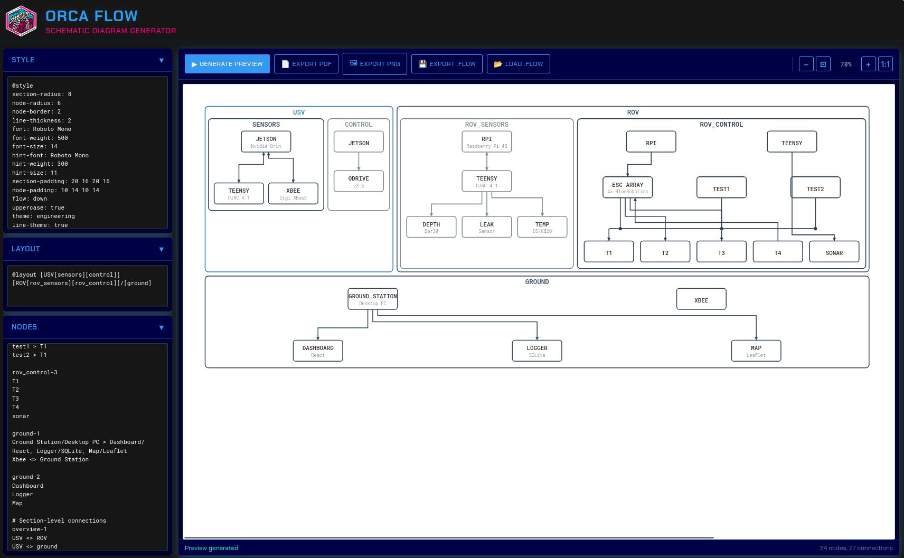

# ORCAflow: Schematic-Style System Diagram Generator

ORCA flow is a web-based tool for creating professional system diagrams with clean orthogonal wire routing—ideal for engineering documentation, technical reports, and publications.




## Roadmap

- [ ] Implement upward connection routing
- [ ] Add cross-section wire routing
- [ ] Support same-row node connections
- [ ] Implement section-to-section connections
- [ ] Add PNG export
- [ ] Add PDF export with page sizing
- [ ] Add `.flow` file save/load
- [ ] Host online demo
- [ ] Markdown/documentation integration

## Features

- **Grid-based layout** — Nodes align to a clean grid within hierarchical segments
- **Orthogonal routing** — Wires travel only horizontally and vertically
- **Schematic style** — Junction dots, uniform spacing, and professional appearance
- **Simple DSL** — Define diagrams with minimal, readable syntax
- **Theming** — Built-in colour themes with accessibility support for colour-blind users
- **Export options** — SVG, PNG, PDF, and `.flow` source files

---

## Quick Start

```sh
# Run locally with Python
cd ORCA_flow
python3 -m http.server 8000
# Open browser to http://localhost:8000
```

**Keyboard Shortcuts:**

- `Ctrl+Enter` - Generate preview
- `Ctrl+Wheel` - Zoom in/out
- `Ctrl+Shift+R` - Hard refresh (after code changes)

**Zoom Controls:** Use the toolbar buttons (−, ⊡, %, +, 1:1) to zoom out, fit to window, zoom in, or reset to 100%.

---

## User Interface Layout

Two-panel web interface:

```
┌─────────────────────────────────────────────────────────────────────────┐
│ ┌─────────────────────────┐ ┌─────────────────────────────────────────┐ │
│ │         STYLE           │ │ [Generate] [PDF] [PNG] [.flow] [−][⊡][+]│ │
│ ├─────────────────────────┤ ├─────────────────────────────────────────┤ │
│ │         LAYOUT          │ │                                         │ │
│ ├─────────────────────────┤ │                                         │ │
│ │                         │ │              PREVIEW                    │ │
│ │         NODES           │ │           (SVG Render)                  │ │
│ │                         │ │                                         │ │
│ │                         │ │                                         │ │
│ │                         │ │                                         │ │
│ └─────────────────────────┘ └─────────────────────────────────────────┘ │
└─────────────────────────────────────────────────────────────────────────┘
```

Layout definition using project's own syntax:
```
[[Style]/[Layout]/[Nodes]][[[Generate][PDF][PNG][.flow][Zoom controls]]/[Preview]]
```

### UI Features

- Left panel: Three collapsible input sections for Style, Layout, and Nodes
- Right panel: Live preview with export buttons and zoom controls
- Export formats: PDF, PNG, and `.flow` source file
- Zoom controls: Fit to window (auto on generate), zoom in/out, reset to 100%
- Keyboard shortcuts: `Ctrl+Enter` to generate, `Ctrl+Wheel` to zoom
- Distribution: Hosted online and downloadable from GitHub for offline use

---

## File Format Specification

File extension: `.flow`

Markdown code fence identifier: `flow`

### Complete File Structure

```
@style
[style parameters]

@layout [segment-bracket-notation]

@nodes
[section-row definitions]
[node and connection definitions]
```

---

## Style Block Specification

The `@style` block defines visual parameters using `key: value` syntax.

### Available Parameters

| Parameter | Description | Default |
|-----------|-------------|---------|
| `section-radius` | Corner radius for segment boxes | `8` |
| `section-border` | Border thickness for section boxes | `2` |
| `node-radius` | Corner radius for node boxes | `6` |
| `node-border` | Border thickness for nodes | `2` |
| `line-thickness` | Connection line thickness | `2` |
| `font` | Primary font (Google Fonts) | `Roboto Mono` |
| `font-weight` | Primary font weight | `500` |
| `font-size` | Primary font size in px | `14` |
| `hint-font` | Hint/subtitle font | `Roboto Mono` |
| `hint-weight` | Hint font weight | `300` |
| `hint-size` | Hint font size in px | `11` |
| `section-padding` | Segment padding (top right bottom left) | `20 16 20 16` |
| `node-padding` | Node padding (top right bottom left) | `10 14 10 14` |
| `flow` | Direction of data flow | `down` |
| `uppercase` | Convert text to uppercase | `true` |
| `theme` | Colour theme preset | `engineering` |
| `line-theme` | Enable line style variations for accessibility | `true` |

### Export and Page Size Parameters

| Parameter | Description | Example |
|-----------|-------------|---------|
| `page-size` | Export page size preset | `A4`, `A3`, `letter`, `custom` |
| `page-width` | Custom page width in mm (if page-size: custom) | `297` |
| `page-height` | Custom page height in mm (if page-size: custom) | `210` |
| `page-orientation` | Page orientation | `landscape` or `portrait` |
| `page-margin` | Page margins in mm (top right bottom left) | `10 10 10 10` |

### Node Size Parameters

| Parameter | Description | Default |
|-----------|-------------|---------|
| `node-min-width` | Minimum node width in px | `120` |
| `node-min-height` | Minimum node height in px | `60` |
| `node-max-width` | Maximum node width in px (0 = no limit) | `0` |
| `node-uniform` | Force all nodes to same size | `true` |

**Node sizing behaviour:**
- Nodes expand automatically to fit content (heading + hint text)
- Nodes expand to accommodate connection ports if many connections exist
- If `node-uniform: true`, all nodes match the size of the largest node
- The system validates that the diagram fits within page bounds and warns if it doesn't

### Example Style Block

```
@style
section-radius: 8
section-border: 2
node-radius: 6
node-border: 2
line-thickness: 2
font: Roboto Mono
font-weight: 500
font-size: 14
hint-font: Roboto Mono
hint-weight: 300
hint-size: 11
section-padding: 20 16 20 16
node-padding: 10 14 10 14
flow: down
uppercase: true
theme: engineering
line-theme: true
page-size: A4
page-orientation: landscape
page-margin: 10 10 10 10
node-min-width: 120
node-min-height: 60
node-uniform: true
```

---

## Theming and Colour System

FlowSchem includes a theming system that automatically assigns colours to sections, with accessibility support for colour-blind users.

### Built-in Themes

Themes automatically assign colours to sections in order. As more sections are added, the next colour in the palette is used.

| Theme | Description | Use Case |
|-------|-------------|----------|
| `default` | Balanced professional palette | General purpose |
| `monochrome` | Greyscale variations | Print-friendly |
| `engineering` | Blues and greys | Technical documentation |
| `warm` | Reds, oranges, yellows | Highlight-focused |
| `cool` | Blues, greens, purples | Calm, professional |
| `high-contrast` | Maximum colour differentiation | Accessibility |

### Line Theme for Accessibility

When `line-theme: true` is enabled, each section also receives a distinct line style in addition to colour. This ensures diagrams remain readable for colour-blind users.

Line style variations:
- Solid
- Dashed (long)
- Dashed (short)
- Dotted
- Dash-dot
- Dash-dot-dot

Example:
```
@style
theme: default
line-theme: true
```

This produces sections with both unique colours AND unique line styles.

### Custom Colour Palette

For full control, define a custom palette with hex colours and assign keys to sections in the layout.

#### Defining Colours

```
@style
palette:
  sensors: #3498db
  control: #e74c3c
  comms: #2ecc71
  ground: #9b59b6
```

#### Assigning Colours to Layout

Use the colour key after the section name with a colon:

```
@layout [USV[sensors:sensors][control:control]][comms:comms]/[ground:ground]
```

Or with named parent sections:

```
@layout [USV:sensors[internal][external]]/[Ground:ground]
```

#### Colour Application

When a colour key is assigned to a section:
- Section border uses the assigned colour
- Node borders within that section use the same colour
- Connection lines originating from nodes in that section use the same colour

### Combining Themes and Custom Colours

If both `theme` and `palette` are specified:
- Custom palette colours take priority for sections with assigned keys
- Theme colours fill in for sections without explicit assignments

Example:
```
@style
theme: engineering
palette:
  critical: #e74c3c
  
@layout [sensors][control:critical][output]
```

Result:
- `sensors`: First colour from engineering theme
- `control`: Custom red (#e74c3c)
- `output`: Second colour from engineering theme

---

## Layout Block Specification

The `@layout` block defines the hierarchical segment structure using bracket notation.

### Syntax Rules

| Pattern | Meaning | CSS Equivalent |
|---------|---------|----------------|
| `[a][b]` | Horizontal segments (side by side) | `flex-direction: row` |
| `[a]/[b]` | Vertical segments (stacked) | `flex-direction: column` |
| `[Name[a][b]]` | Named parent containing children | Nested flex container |
| `[section:colour_key]` | Section with assigned colour | Uses palette colour |

### Examples

**Two horizontal segments:**
```
@layout [sensors][processing]
```
```
┌──────────────┬──────────────┐
│   sensors    │  processing  │
└──────────────┴──────────────┘
```

**Two vertical segments:**
```
@layout [sensors]/[processing]
```
```
┌──────────────┐
│   sensors    │
├──────────────┤
│  processing  │
└──────────────┘
```

**Complex nested layout:**
```
@layout [USV[usv_sensors]/[usv_control]][ROV[rov_sensors]/[rov_control]]/[ground]
```
```
┌─────────────────────────────┬─────────────────────────────┐
│            USV              │            ROV              │
│ ┌─────────────────────────┐ │ ┌─────────────────────────┐ │
│ │       usv_sensors       │ │ │       rov_sensors       │ │
│ ├─────────────────────────┤ │ ├─────────────────────────┤ │
│ │       usv_control       │ │ │       rov_control       │ │
│ └─────────────────────────┘ │ └─────────────────────────┘ │
├─────────────────────────────┴─────────────────────────────┤
│                          ground                           │
└───────────────────────────────────────────────────────────┘
```

---

## Nodes Block Specification

The `@nodes` block defines nodes and their connections using a row-based syntax.

### Row Header Syntax

```
segment_name-row_number
```

Example: `sensors-1` means row 1 within the "sensors" segment.

### Node Definition Syntax

```
NodeName [connection] TargetNode
```

**Critical rule:** The first node (left side) is placed on the current row. The second node (right side) is placed elsewhere and resolved during the connection routing phase.

### Connection Symbols

| Symbol | Meaning | Visual |
|--------|---------|--------|
| `>` | Solid arrow, flows to target | `A ───> B` |
| `<` | Solid arrow, flows from target | `A <─── B` |
| `<>` | Solid bidirectional | `A <──> B` |
| `->` | Dashed arrow, flows to target | `A ┈┈┈> B` |
| `<-` | Dashed arrow, flows from target | `A <┈┈┈ B` |
| `<->` | Dashed bidirectional | `A <┈┈> B` |

**Note on `<` and `<-` operators:** These reverse the connection direction. `A < B` means B connects TO A (the wire originates from B and terminates at A with an arrow). This is useful for defining incoming connections while keeping the primary node (A) on the left side of the definition.

### Node Label Syntax

| Pattern | Result |
|---------|--------|
| `NodeName` | Heading only |
| `NodeName/hint` | Heading with hint text below |

### Multiple Targets

Use comma separation for multiple targets from the same source:

```
Teensy > GPS, IMU, Pressure
```

### Standalone Nodes

A line with no connection symbol creates a standalone node:

```
sensors-1
Status LED
Power Indicator
```

### Section-to-Section Connections

Sections can be treated as nodes for high-level connections. This is useful for showing data flow between major subsystems without detailing internal nodes.

Use the section name directly in the nodes block:

```
@nodes
system-1
MCU <> Sensors
MCU <> Actuators
AUV < Payload
```

This creates connections between section boxes rather than individual nodes within them. The wire routes from the section boundary box itself.

Section-to-section connections are particularly useful for:
- Overview diagrams showing subsystem relationships
- Indicating data flow direction between major components
- Connecting external systems (like Payload) to internal sections

### Complete Nodes Example

```
@nodes
sensors-1
Jetson/Nvidia Orin <> Teensy/PJRC 4.1
Jetson <> Xbee/Digi 900MHz

sensors-2
Teensy > GPS/u-blox NEO-M8N, IMU/BNO085, Pressure/MS5611
Xbee <> Ground Station

control-1
Jetson > Motor Driver/ODrive 3.6

control-2
Motor Driver > Thruster L, Thruster R

ground-1
Ground Station/Base PC > Dashboard, Logger

# Section-level connection
system-1
USV <> Ground
ROV <> USV
```

**Resulting node placement:**
- sensors row 1: Jetson (with two connections out)
- sensors row 2: Teensy, Xbee
- sensors row 3 (implicit): GPS, IMU, Pressure, Ground Station
- control row 1: Jetson (same node, different segment reference)
- control row 2: Motor Driver
- control row 3 (implicit): Thruster L, Thruster R
- ground row 1: Ground Station
- ground row 2 (implicit): Dashboard, Logger
- Section-level: USV connects to Ground, ROV connects to USV

---

## Parsing Logic

### Two-Pass Parser

**Pass 1: Node Collection**
1. Parse `@style` into configuration object (including theme and palette)
2. Parse `@layout` into segment tree structure with colour assignments
3. For each row in `@nodes`:
   - Extract section name and row number from header
   - Collect unique first-position nodes for that row
   - Identify section-to-section connections (where node name matches a section name)
   - Store connection definitions for pass 2

**Pass 2: Connection Resolution**
1. Build node position map (segment, row, horizontal position)
2. Apply theme colours to sections without explicit palette assignments
3. If `line-theme: true`, assign line styles to each section
4. For each connection:
   - Look up source node position (or section boundary if section-to-section)
   - Look up target node position (or section boundary if section-to-section)
   - Determine wire routing based on relative positions
   - Apply appropriate colour and line style

### Node Placement Rules

1. First node on a line is placed on the current row
2. If the same first node appears on multiple lines, it's one node with multiple connections
3. Target nodes (right side) are placed on their own defined rows
4. If a node only appears as a target (never as first node), raise an error
5. If a node name matches a section name, treat it as a section-to-section connection

---

## Rendering Specification

### SVG Output

The renderer produces SVG with:
- `<rect>` elements for segment boxes and node boxes
- `<text>` elements for labels and hints
- `<path>` elements for orthogonal wire routes
- `<circle>` elements for junction dots
- Stroke colours and dash patterns based on theme/palette and line-theme settings

### Node Placement Algorithm

Nodes are positioned within sections using a grid-based layout.

#### Column Positioning (Even Spacing)

For `n` nodes in a row, each node `k` (1-indexed) is placed at column fraction:

```
column = (2k - 1) / (2n)
```

Examples:

- 1 node: position at 1/2 = 0.5 (centered)
- 2 nodes: positions at 1/4, 3/4 (0.25, 0.75)
- 3 nodes: positions at 1/6, 3/6, 5/6 (0.167, 0.5, 0.833)
- 4 nodes: positions at 1/8, 3/8, 5/8, 7/8 (0.125, 0.375, 0.625, 0.875)

#### Row Spacing (Grid Height Calculation)

The vertical space between rows is calculated based on the number of routing channels needed. With channel sharing optimization, we count unique targets rather than individual connections:

```py
## @brief Calculates grid height between adjacent rows.
#
#  With channel sharing, multiple connections TO the same target node
#  share a single horizontal channel, reducing vertical space requirements.
#
#  @param unique_targets Number of unique target nodes with non-aligned sources
#  @param has_bidirectional True if any connection uses bidirectional arrows
#  @return Grid height in channel units (minimum 3)

def calculate_grid_height(unique_targets, has_bidirectional):
    arrow_space_source = 1 if has_bidirectional else 0  # Space for upward arrows
    arrow_space_dest = 1   # Always need space for downward arrows
    buffer = 1             # Minimum routing clearance

    return max(3, unique_targets + arrow_space_source + arrow_space_dest + buffer)
```

Where:

- `unique_targets`: Count of unique target nodes with non-vertically-aligned sources (not total connections)
- `arrow_space_source`: 1 if any bidirectional connections exist (arrows pointing up), else 0
- `arrow_space_dest`: 1 (always need space for arrows pointing into target nodes)
- `buffer`: 1 (minimum spacing)
- Minimum grid height: 3 units

#### Channel Sharing Optimization (Target-Based Merging)

Multiple connections TO the same target node share a single horizontal routing channel. This produces clean wire merging where incoming connections join at a shared bus line before dropping to the target.

**Key principle:** Wires merge when entering a node (multiple sources → one target), but split cleanly when leaving (one source → multiple targets).

```text
Outgoing (splitting):     Incoming (merging):
    [Source]                  [Target]
        │                         ▲
    ┌───┴───┐                     │
    │       │                 ────●────●────  ← shared bus with junction dots
    ▼       ▼                     │    │
[Target A] [Target B]         [Src A] [Src B]

No junction dots             Junction dots at source positions
(clean split)                (indicates merge)
```

Implementation in `buildConnectionRoutes()`:

```py
## @brief Groups connections by target node for channel sharing.
#
#  Connections to the same target share one horizontal channel,
#  merging at junction points from different sources.
#
#  @param row_connections All connections from source row to target rows
#  @return Dictionary mapping target_id to list of connections

connections_by_target = {}
for conn in row_connections:
    target_id = conn.target.id
    if target_id not in connections_by_target:
        connections_by_target[target_id] = []
    connections_by_target[target_id].append(conn)
```

### Wire Routing Algorithm

#### Routing Principles

1. Wires travel only horizontally or vertically (orthogonal routing)
2. Use channel-based routing between rows to prevent overlap
3. Vertically aligned nodes use straight lines (no corners)
4. Non-aligned connections use L-shaped paths: down → horizontal → down

#### Exit Position Calculation

Vertical routing corridors (exit positions) are placed at evenly-spaced columns between nodes. For `n` nodes in a row, there are `n+1` exit positions:

```
Exit positions = e/n for e in [0..n]
```

Examples:

- 1 node: exits at 0/1, 1/1 = 0.0, 1.0 (left and right edges)
- 2 nodes: exits at 0/2, 1/2, 2/2 = 0.0, 0.5, 1.0
- 3 nodes: exits at 0/3, 1/3, 2/3, 3/3 = 0.0, 0.333, 0.667, 1.0
- 4 nodes: exits at 0/4, 1/4, 2/4, 3/4, 4/4 = 0.0, 0.25, 0.5, 0.75, 1.0

```text
Nodes at:     0.25      0.75        Exit positions:
              ┌───┐     ┌───┐       │         │         │
              │ A │     │ B │       0.0       0.5       1.0
              └───┘     └───┘       │         │         │
```

Exit positions are used when wires must route through corridors between nodes.

#### Clear Corridor Detection

Before routing through an exit position, the algorithm checks if the source or target column falls in a "clear corridor"—a gap between adjacent nodes where wires can pass directly without detouring.

```py
## @brief Checks if a column position is in a clear corridor between nodes.
#
#  A clear corridor exists:
#  - To the left of the leftmost node
#  - To the right of the rightmost node
#  - Between any two adjacent nodes
#
#  @param col Column position (0.0 to 1.0)
#  @param row_data Row containing nodes to check against
#  @param margin Safety margin from node edges (default 0.02)
#  @return True if column is in a clear corridor

def is_column_in_clear_corridor(col, row_data, margin=0.02):
    nodes = row_data.nodes
    if len(nodes) == 0:
        return True

    node_columns = sorted([n.column for n in nodes])

    # Clear to the left of leftmost node
    if col < node_columns[0] - margin:
        return True

    # Clear to the right of rightmost node
    if col > node_columns[-1] + margin:
        return True

    # Check gaps between adjacent nodes
    for i in range(len(node_columns) - 1):
        left_node = node_columns[i]
        right_node = node_columns[i + 1]
        if col > left_node + margin and col < right_node - margin:
            return True

    return False
```

#### Optimal Routing Column Selection

When routing between rows, the algorithm selects the optimal vertical corridor using this priority:

1. **Source column** (if clear): Wire goes straight down from source, turns later
2. **Target column** (if clear): Wire turns early to align with target
3. **Nearest exit position**: Falls back to calculated exit position between source and target

```py
## @brief Selects optimal routing column for a connection.
#
#  Prioritizes direct paths through source or target columns when clear,
#  avoiding unnecessary detours to exit positions.
#
#  @param source Source node
#  @param target Target node
#  @param adjacent_row Row data to check for obstructions
#  @return Optimal column position for vertical routing

def select_optimal_routing_column(source, target, adjacent_row):
    # Priority 1: Source column (go straight, turn later)
    if is_column_in_clear_corridor(source.column, adjacent_row):
        return source.column

    # Priority 2: Target column (turn early)
    if is_column_in_clear_corridor(target.column, adjacent_row):
        return target.column

    # Priority 3: Nearest exit position
    return select_exit_position_for_row(source, target, adjacent_row)
```

This optimization produces more direct wire paths:

```text
Without optimization:          With optimization:
[Source 0.9]                   [Source 0.9]
     │                              │
     └──────┐ exit at 0.5           │ straight down (source col clear)
            │                       │
            │                       └──────┐ turn at row boundary
            │                              │
     [Target 0.5]                   [Target 0.5]
```

#### Per-Gap Channel Assignment

Each gap between rows maintains independent channel numbering. Channels are numbered 1, 2, 3... within each gap, rather than using a global channel count. This prevents excessive spacing when a diagram has many connections in one area but few in another.

```text
Row 1         [A]         [B]
               │           │
Gap 1-2:   ch1 │        ch2│   (2 channels in this gap)
               │           │
Row 2         [C]         [D]
               │
Gap 2-3:   ch1 │                (1 channel in this gap)
               │
Row 3         [E]
```

The grid height between rows is calculated based only on connections that pass through that specific gap, not total connections in the section.

#### Section-Scoped Grid Height

When calculating grid height between rows, only connections within the current section are counted. This prevents sections with few internal connections from inheriting large spacing caused by connections in other sections.

```py
## @brief Calculates grid height filtering to current section only.
#
#  @param row_above Upper row data
#  @param row_below Lower row data
#  @param nodes_data Full node map
#  @param section_node_ids Set of node IDs in current section (or None for all)
#  @return Grid height in channel units

def calculate_grid_height(row_above, row_below, nodes_data, section_node_ids=None):
    channels_needed = set()

    for node_id in nodes_data.node_map:
        # Skip nodes not in this section
        if section_node_ids and node_id not in section_node_ids:
            continue

        source_node = nodes_data.node_map[node_id]
        for conn in source_node.connections_out:
            target_id = conn.to

            # Skip targets not in this section
            if section_node_ids and target_id not in section_node_ids:
                continue

            # Check if connection passes through this gap
            if passes_through_gap(source_node, target_id, row_above, row_below):
                channels_needed.add(target_id)

    return max(3, len(channels_needed) + 2)  # +2 for arrow space and buffer
```

#### Lane Assignment for Shared Exit Positions

When multiple wires share the same exit position (vertical corridor), they are assigned horizontal lane offsets to prevent overlap. Wires are spread symmetrically around the exit position.

```py
## @brief Assigns horizontal lane offsets to routes sharing an exit position.
#
#  Routes are sorted by target column and spread with 8px spacing.
#
#  @param routes List of routes using same exit position
#  @return Map of route to lane offset in pixels

lane_spacing = 8  # pixels between adjacent wires

def assign_lane_offsets(routes):
    if len(routes) <= 1:
        return {}

    # Sort by target column (left to right)
    routes.sort(key=lambda r: r.target.column)

    num_routes = len(routes)
    total_width = (num_routes - 1) * lane_spacing
    start_offset = -total_width / 2

    offsets = {}
    for idx, route in enumerate(routes):
        offsets[route] = start_offset + idx * lane_spacing

    return offsets
```

Visual example with 3 wires sharing exit position 0.5:

```text
       Without lane assignment:        With lane assignment:
              │││                          │ │ │
              │││  all at 0.5              │ │ │  spread ±8px
              │││                          │ │ │
              ▼▼▼                          ▼ ▼ ▼
```

#### Channel Assignment (Preventing Crossings)

Connections are grouped by target, then each target group is assigned a unique channel. Groups are sorted by target column position (left to right) and assigned channel numbers from highest to lowest:

```text
Leftmost target  → Highest channel (closest to source row)
Rightmost target → Lowest channel (closest to destination row)
```

All connections to the same target share that target's assigned channel.

#### Example: Teensy connecting to GPS, IMU, Pressure

Given:

- Teensy at column 0.25 (row 2)
- GPS at column 0.125 (row 3, leftmost)
- IMU at column 0.375 (row 3, middle)
- Pressure at column 0.625 (row 3, rightmost)

Channel assignment:

```
Source Row:  [TEENSY 0.25]              [XBEE 0.75]
                  │                         │
Channel 4:    ────┼── (GPS, turns left) ────┤
                  │                         │
Channel 3:    ────┼───── (IMU) ─────────────┤
                  │                         │
Channel 2:    ────┼─────────── (Pressure) ──┤
                  │                         │
Channel 1:    ────┼──────────── (Ground) ───┤
                  │       arrows            │
Target Row:  [GPS][IMU][PRESSURE]    [GROUND STATION]
            0.125 0.375  0.625           0.875
```

This ordering ensures:

- GPS (leftmost) uses channel 4 (highest, closest to source)
- IMU uses channel 3
- Pressure uses channel 2
- Ground Station uses channel 1 (lowest, closest to destination)

Wires never cross because each turns at a unique horizontal position.

#### Straight Lines

When source and target have the same column (within tolerance), the connection renders as a straight vertical line without horizontal segments:

```
    [Node A]
        │
        │  ← straight line (no corners)
        │
    [Node B]
```

#### Path Structure

For non-aligned connections, the path consists of three segments:

1. Vertical down: From source node bottom to the horizontal channel
2. Horizontal: Along the channel to align with target column
3. Vertical down: From channel to target node top

```
    [Source]
        │
        │ ← segment 1 (down to channel)
        └────────────┐ ← segment 2 (horizontal)
                     │
                     │ ← segment 3 (down to target)
                [Target]
```

#### Arrow Placement

Arrows are rendered **outside** the node, pointing **into** the node edge:

- The arrow tip touches the node boundary
- The arrow body extends outward from the node
- This follows schematic convention where arrows indicate signal direction

```text
Arrow pointing into target:     Bidirectional arrows:
        │                              ▲
        │                              │
        ▼  ← tip at node edge          │
    ┌───────┐                      ┌───────┐
    │ Node  │                      │ Node  │
    └───────┘                      └───────┘
                                       │
                                       │
                                       ▼
```

- Unidirectional (`>`) or (`>`): Arrow at target only (pointing into node)
- Bidirectional (`<>`): Arrows at both source and target (both pointing into their respective nodes)

---

## Connection Port Specification

### Port Types

Each node has connection ports at its top and bottom edges. Ports are classified by direction:

| Port Type     | Symbol | Description                           |
| ------------- | ------ | ------------------------------------- |
| Outgoing      | `>`    | Line exits node, arrow at destination |
| Incoming      | `<`    | Arrow enters node, line from source   |
| Bidirectional | `<>`   | Arrows at both ends of connection     |

### Port Placement Rules

#### 1. Port Edge Selection

The edge (top or bottom) is determined by the relative row position of connected nodes:

| Source Row vs Target Row | Source Port Edge | Target Port Edge |
| ------------------------ | ---------------- | ---------------- |
| Source above target      | Bottom           | Top              |
| Source below target      | Top              | Bottom           |
| Same row                 | Bottom           | Bottom           |

#### 2. Port Spacing

Multiple ports on the same edge are spaced evenly from the node centre:

```
Single port:     ────┬────
                     │

Two ports:       ──┬───┬──
                   │   │

Three ports:     ─┬──┬──┬─
                  │  │  │
```

Formula for `n` ports, port `k` (1-indexed):

```
offset_from_centre = (2k - 1 - n) × port_spacing / 2
```

#### 3. Port Ordering

Ports are ordered left-to-right based on destination column to minimise wire crossings:

- Leftmost destination → Leftmost port
- Rightmost destination → Rightmost port

### Wire Routing Rules

#### 1. Orthogonal Paths Only

All connection wires travel horizontally or vertically. No diagonal lines.

#### 2. Path Structure

Connections between nodes on different rows use a three-segment path:

```
    [Source]
        │         ← Vertical segment (from source port)
        └────────┐← Horizontal segment (routing channel)
                 │
                 ↓← Vertical segment (to target port)
            [Target]
```

#### 3. No Overlapping Wires

Connection wires must not overlap or be coincident. Each wire uses a unique routing channel.

#### 4. Junction Dots (Incoming Wire Merging)

Junction dots appear only when multiple source nodes connect to the same target. The dots are placed at each source's X position on the shared horizontal bus line, indicating where wires merge before dropping to the target.

```text
Single source to target:       Multiple sources to same target:
┌────────┐                     ┌────────┐
│  ESC   │                     │   T1   │
└────────┘                     └────────┘
    │                              ▲
    │                              │
    │                          ────●────●────  ← junction dots at source positions
    │                              │    │
    ▼                          ┌───┴──┐ │
┌────────┐                     │ Src1 │ │
│   T1   │                     └──────┘ │
└────────┘                          ┌───┴──┐
                                    │ Src2 │
No junction dots                    └──────┘
(single connection)            Junction dots show merge points
```

**Important:** Junction dots only appear on incoming connections (multiple sources → one target). When a single source connects to multiple targets (splitting), no junction dots are used—the wires simply branch cleanly.

If wires cross without a junction dot, they are not electrically connected (schematic convention).

#### 5. Channel Assignment

Horizontal routing channels are assigned to prevent crossings:

- Group connections by target node (connections to the same target share a channel)
- Sort target groups by column position (left to right)
- Assign channels from highest to lowest (leftmost targets get channels closest to source row)

### Node Sizing

#### Default Behaviour

- Nodes have a minimum width (`node-min-width`) and height (`node-min-height`)
- Height expands automatically if hint text exceeds the minimum
- Width expands automatically to fit heading text

#### Uniform Mode

When `node-uniform: true`:

- All nodes in a section match the size of the largest node
- Creates cleaner, more aligned diagrams

### Content-Based Section Sizing

Sections are sized to fit their content rather than stretching to fill available page space. This produces compact diagrams suitable for documents and journal articles.

#### Section Height Calculation

```py
## @brief Calculates section height based on node content.
#
#  Section height is the sum of:
#  - Label height (30px for section heading)
#  - All node rows (each row = node_height)
#  - Grid spacing between rows (for wire routing channels)
#  - Bottom padding (16px)
#
#  Spacing is only added BETWEEN rows, not after the last row.
#
#  @param section_layout Layout data with rows and grid heights
#  @param node_height Height of each node (based on text content)
#  @param channel_spacing Pixels per routing channel (15px)
#  @param row_spacing Minimum space between rows (20px)
#  @return Total section height in pixels

def calculate_section_height(section_layout, node_height, channel_spacing, row_spacing):
    label_height = 30       # Section heading
    section_padding = 16    # Bottom padding

    content_height = label_height

    for i, row in enumerate(section_layout.rows):
        content_height += node_height

        # Add spacing only BETWEEN rows (not after the last row)
        is_last_row = (i == len(section_layout.rows) - 1)
        if not is_last_row:
            if i < len(section_layout.grid_heights):
                grid_space = section_layout.grid_heights[i] * channel_spacing
                content_height += max(row_spacing, grid_space)
            else:
                content_height += row_spacing

    content_height += section_padding
    return content_height
```

#### Node Height Calculation

Node height is based on text content, not available section space:

```py
## @brief Calculates node height based on text content.
#
#  Height depends on whether any node in the section has hint text.
#  All nodes in a section use the same height for visual consistency.
#
#  @param font_size Heading font size in pixels
#  @param hint_size Hint font size in pixels
#  @param node_padding Padding values { top, right, bottom, left }
#  @param has_any_hints True if any node in section has hint text
#  @return Node height in pixels

def calculate_node_height(font_size, hint_size, node_padding, has_any_hints):
    line_spacing = 6  # Space between heading and hint

    if has_any_hints:
        text_height = font_size + line_spacing + hint_size
    else:
        text_height = font_size

    return node_padding.top + text_height + node_padding.bottom
```

#### Nested Section Sizing

For parent sections with nested children, the size is calculated recursively:

```py
## @brief Calculates size of parent section with nested children.
#
#  For row layout: width = sum of children, height = max of children
#  For column layout: width = max of children, height = sum of children
#
#  @param children List of child layout nodes
#  @param direction 'row' or 'column'
#  @param gap Spacing between children (10px)
#  @param padding Inner padding (8px)
#  @param label_height Section label height (30px)
#  @return { width, height } in pixels

def calculate_parent_size(children, direction, gap, padding, label_height):
    child_sizes = [calculate_node_content_size(child) for child in children]

    if direction == 'row':
        width = sum(s.width for s in child_sizes) + gap * (len(children) - 1)
        height = max(s.height for s in child_sizes)
    else:  # column
        width = max(s.width for s in child_sizes)
        height = sum(s.height for s in child_sizes) + gap * (len(children) - 1)

    return {
        'width': width + padding * 2,
        'height': height + label_height + padding
    }
```

### Node Rendering

```
┌────────────────────────┐
│      HEADING TEXT      │  ← font, font-weight, font-size
├────────────────────────┤
│       hint text        │  ← hint-font, hint-weight, hint-size
└────────────────────────┘
```

### Colour and Line Style Application

- Section borders: Theme or palette colour
- Node borders: Inherit from parent section
- Connection lines: Colour from source node's section
- Line style: If `line-theme: true`, apply section's assigned line pattern

---

## Complete Example File

```js
@style
section-radius: 8
section-border: 2
node-radius: 6
node-border: 2
line-thickness: 2
font: Roboto Mono
font-weight: 500
font-size: 14
hint-font: Roboto Mono
hint-weight: 300
hint-size: 11
section-padding: 20 16 20 16
node-padding: 10 14 10 14
flow: down
uppercase: true
theme: engineering
line-theme: true

@layout [USV[sensors][control]][ROV[rov_sensors][rov_control]]/[ground]

@nodes
sensors-1
Jetson/Nvidia Orin <> Teensy/PJRC 4.1
Jetson <> Xbee/Digi XBee3

sensors-2
Teensy > GPS/u-blox NEO-M8N, IMU/BNO085, Pressure/MS5611
Xbee <> Ground Station

sensor-3
GPS
IMU
Pressure

control-1
Jetson > ODrive/v3.6

control-2
ODrive > Thruster L, Thruster R

control-3
Thruster L
Thruster R

rov_sensors-1
RPi/Raspberry Pi 4B <> Teensy/PJRC 4.1

rov_sensors-2
Teensy > Depth/Bar30, Leak/Sensor, Temp/DS18B20

rov_sensors-3
Depth
Leak
Temp

rov_control-1
RPi > ESC Array/4x BlueRobotics
RPi < test1
RPi < test3

rov_control-2
ESC Array > T1, T2, T3, T4
test1 > test2 
test3

rov_control-3
T1
T2
T3
T4
test2

ground-1
Ground Station/Desktop PC > Dashboard/React, Logger/SQLite, Map/Leaflet
Xbee <> Ground Station

ground-2
Dashboard/React
Logger
Map

# Section-level connections
overview-1
USV <> ROV
USV <> ground
```

---

## Custom Palette Example

```
@style
section-radius: 6
node-radius: 4
line-thickness: 2
font: Inter
theme: default
line-theme: true
palette:
  nav: #2980b9
  power: #c0392b
  comms: #27ae60
  payload: #8e44ad

@layout [Navigation:nav][Power:power]/[Communications:comms][Payload:payload]

@nodes
Navigation-1
GPS/u-blox > MCU
IMU/BNO085 > MCU

Power-1
Battery/4S LiPo > BMS
BMS > 5V Rail, 12V Rail

Communications-1
MCU <> Radio/LoRa
Radio <> Ground

Payload-1
Camera/RPi Cam > Companion/RPi
Companion > MCU

# Section connections showing data flow
system-1
Navigation > Payload
Power > Navigation, Communications, Payload
```

---

## Technology Recommendations

### Frontend
- **Framework:** React or vanilla JavaScript with SVG
- **Styling:** CSS Flexbox for panel layout, SVG for diagram
- **Fonts:** Google Fonts integration

### Export
- **PNG:** Canvas API or html2canvas
- **PDF:** jsPDF or similar library
- **Source:** Plain text `.flow` file download

### Offline Distribution
- Single HTML file with embedded CSS/JS, or
- Simple npm package that runs local server

---

## Future Enhancement: Markdown Integration

Enable embedding in markdown files using fenced code blocks:

```markdown
# System Architecture

​```flow
@style
node-radius: 6
flow: down
theme: engineering

@layout [sensors]/[processing]

@nodes
sensors-1
GPS, IMU

processing-1
sensors > MCU
​```
```

### Implementation Options

1. **GitHub Action:** Pre-render `.flow` blocks to SVG on commit
2. **Custom Plugin:** For static site generators (Hugo, Jekyll, Docusaurus)
3. **JavaScript Library:** Client-side rendering for live documentation sites

---

## Summary

FlowSchem provides engineers with a simple DSL for creating professional schematic-style system diagrams. The syntax prioritises minimal typing while maintaining clarity:

- **Style:** Key-value configuration for visual parameters and theming
- **Layout:** Bracket notation for hierarchical segments `[A[B][C]]/[D]` with optional colour keys
- **Nodes:** Row-based definitions with inline connections using `>` `<` `<>` symbols
- **Sections as Nodes:** Connect entire sections for high-level diagrams
- **Theming:** Built-in colour themes with automatic assignment, plus custom palettes
- **Accessibility:** `line-theme` option for colour-blind friendly diagrams
- **Output:** Clean SVG with orthogonal wire routing, exportable to PDF/PNG

### Wire Routing Behaviour

- **Outgoing wires (splitting):** When one source connects to multiple targets, wires branch cleanly without junction dots
- **Incoming wires (merging):** When multiple sources connect to the same target, wires share a horizontal channel with junction dots at each source position
- **Arrows:** Rendered outside nodes, pointing into the node edge (tip touches node boundary)
- **Channel assignment:** Based on unique targets, not individual connections—connections to the same target share a channel
- **Exit positions:** Vertical corridors at `e/n` for `e` in `[0..n]` where wires route between rows
- **Clear corridor optimization:** Wires route through source/target column directly when no nodes block the path
- **Source column priority:** For upward connections, wires go straight through source column first, then turn
- **Per-gap channels:** Each row gap has independent channel numbering to prevent excessive spacing
- **Section-scoped height:** Grid height calculation only counts connections within the current section
- **Lane assignment:** Multiple wires sharing an exit position are spread with 8px horizontal offsets

The tool solves the specific problem of creating neat, grid-aligned system diagrams that existing tools like Mermaid cannot produce.

---

## Demo Example

Copy and paste this into the app to test all features:

```flow
@style
section-radius: 8
node-radius: 6
node-border: 2
line-thickness: 2
font: Roboto Mono
font-weight: 500
font-size: 14
hint-font: Roboto Mono
hint-weight: 300
hint-size: 11
section-padding: 20 16 20 16
node-padding: 10 14 10 14
flow: down
uppercase: true
theme: engineering
line-theme: true

@layout [ROV[rov_control]]

@nodes
rov_control-1
RPi > test1
RPi < test3

rov_control-2
test1 > T1
test1 > T2
test1 > T3
test1 < T4
test2 > test3

rov_control-3
T1
T2
T3
T4
test3
```

```flow
@style
section-radius: 8
node-radius: 6
node-border: 2
line-thickness: 2
font: Roboto Mono
font-weight: 500
font-size: 14
hint-font: Roboto Mono
hint-weight: 300
hint-size: 11
section-padding: 20 16 20 16
node-padding: 10 14 10 14
flow: down
uppercase: true
theme: engineering
line-theme: true

@layout [USV[sensors][control]][ROV[rov_sensors][rov_control]]/[ground]

@nodes
sensors-1
Jetson/Nvidia Orin <> Teensy/PJRC 4.1
Jetson <> Xbee/Digi XBee3

sensors-2
Teensy > GPS/u-blox NEO-M8N, IMU/BNO085, Pressure/MS5611
Xbee <> Ground Station

control-1
Jetson > ODrive/v3.6

control-2
ODrive > Thruster L, Thruster R

rov_sensors-1
RPi/Raspberry Pi 4B <> Teensy/PJRC 4.1


rov_sensors-2
Teensy > Depth/Bar30, Leak/Sensor, Temp/DS18B20

rov_sensors-3
Depth
Leak
Temp

rov_control-1
RPi > ESC Array/4x BlueRobotics
Teensy > sonar

rov_control-2
ESC Array > T1
ESC Array > T2
ESC Array > T3
ESC Array < T4
test1 > T1
test2 > T1

rov_control-3
T1
T2
T3
T4
sonar

ground-1
Ground Station/Desktop PC > Dashboard/React, Logger/SQLite, Map/Leaflet
Xbee <> Ground Station

ground-2
Dashboard
Logger
Map

# Section-level connections
overview-1
USV <> ROV
USV <> ground
```
